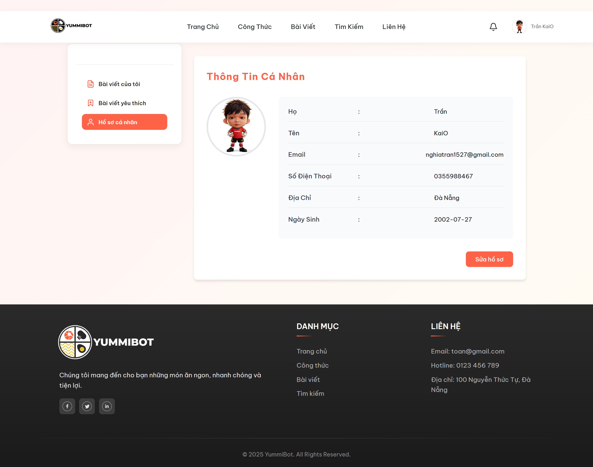
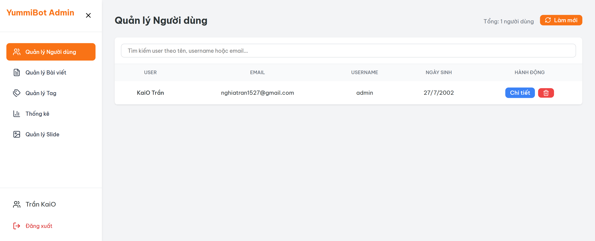

# YummiBot-description

# YummiBot

## Mô tả dự án

**YummiBot** là một nền tảng web ứng dụng trí tuệ nhân tạo (AI) để quản lý, chia sẻ và gợi ý công thức nấu ăn, bài viết về thực phẩm. Dự án được xây dựng theo kiến trúc microservices với ba thành phần chính: backend API (Django), frontend giao diện người dùng (React), và dịch vụ AI cho gợi ý thực phẩm (FastAPI với mô hình SBERT). Ứng dụng hỗ trợ người dùng đăng ký, đăng nhập, chia sẻ bài viết, quản lý công thức, và nhận gợi ý thực phẩm cá nhân hóa thông qua chatbot AI.

## Cấu trúc tổng quan của dự án

Dự án được tổ chức thành các folder chính:

- **Back-End**: Chứa API backend sử dụng Django REST Framework.
- **Font-End**: Chứa giao diện frontend sử dụng React và Vite.
- **SBERT**: Chứa dịch vụ AI cho gợi ý thực phẩm và chatbot.
- **docker-compose.yml**: Cấu hình để chạy toàn bộ hệ thống bằng Docker (bao gồm PostgreSQL database).

Dự án sử dụng Docker Compose để dễ dàng triển khai và chạy trên môi trường phát triển hoặc sản xuất, với các service kết nối qua mạng nội bộ.

## Chi tiết từng thành phần

### 1. Backend (Back-End)

- **Công nghệ**: Django 3.2.21, Django REST Framework, PostgreSQL, Channels (cho WebSocket).
- **Chức năng chính**:
  - Quản lý người dùng: Đăng ký, đăng nhập, xác thực JWT, quản lý hồ sơ (bao gồm avatar).
  - Quản lý nội dung: Bài viết về thực phẩm (posts), công thức nấu ăn, slides/banner, thống kê.
  - Tích hợp AI: Kết nối với dịch vụ SBERT để gợi ý thực phẩm.
  - Tích hợp bên thứ ba: OpenAI API (ChatGPT), Google Gemini API cho chatbot và xử lý ngôn ngữ tự nhiên.
  - Media management: Upload và quản lý hình ảnh (avatars, categories, posts, slides) với hỗ trợ AWS S3 hoặc local storage.
  - WebSocket: Hỗ trợ real-time chat hoặc notifications qua Channels.
  - Admin panel: Giao diện quản trị Django để quản lý dữ liệu.
- **Cấu trúc thư mục**:
  - `foodAPI/`: Thư mục chính của Django project.
    - `core/`: App chính chứa models (User, Post, Food, etc.), serializers, views, URLs.
    - `postFood/`, `slides/`, `statistical/`: Các app con cho chức năng cụ thể.
    - `submodels/`: Models phụ (notifications, postfood, slides).
    - `images/`: Thư mục lưu trữ hình ảnh.
  - `requirements.txt`: Danh sách dependencies (Django, DRF, Pillow, boto3, google-generativeai, etc.).
- **Cấu hình**: Sử dụng PostgreSQL làm database chính (có thể cấu hình qua .env). Hỗ trợ CORS, JWT authentication, và media protection.

### 2. Frontend (Font-End)

- **Công nghệ**: React 19, Vite, Axios, React Router, Lucide React (icons), React Slick (carousel), Recharts (charts), React Toastify (notifications).
- **Chức năng chính**:
  - Giao diện người dùng: Trang chủ, tìm kiếm, hiển thị công thức, chi tiết bài viết, profile cá nhân.
  - Quản lý người dùng: Đăng nhập/đăng ký, quên mật khẩu, quản lý hồ sơ.
  - Tương tác: Tạo bài viết, bình luận, thích, chia sẻ công thức.
  - Admin panel: Giao diện quản trị cho admin (dashboard, quản lý users, posts, tags, analytics).
  - Responsive design: Hỗ trợ mobile và desktop với CSS modules.
  - Tích hợp API: Gọi backend API qua Axios, hiển thị dữ liệu real-time.
- **Cấu trúc thư mục**:
  - `src/`: Source code React.
    - `components/`: Các component UI (Header, Footer, FoodDisplay, ChatBox, etc.).
    - `pages/`: Các trang (Home, Profile, Admin, Recipes, etc.).
    - `context/`: StoreContext cho quản lý state toàn cục.
    - `utils/`: Utilities (dateTime.js).
  - `package.json`: Dependencies và scripts (dev, build, lint).
- **Cấu hình**: Sử dụng Vite cho development server (port 5173), ESLint cho linting.

### 3. AI Service (SBERT)

- **Công nghệ**: FastAPI, Uvicorn, Sentence Transformers (SBERT), Scikit-learn, Torch, Google Generative AI.
- **Chức năng chính**:
  - Gợi ý thực phẩm: Sử dụng mô hình SBERT để tính toán embeddings và gợi ý công thức dựa trên sở thích người dùng.
  - Chatbot: Tích hợp Google Gemini để trò chuyện và tư vấn về thực phẩm.
  - API endpoints: /docs (Swagger UI), /ai (retrain model), /chatbot (chat), /static (serve images).
  - Data processing: Xử lý dữ liệu từ CSV, SQLite, embeddings (enhanced_food_embeddings.pt).
- **Cấu trúc thư mục**:
  - `food-recommend-api/`: Thư mục chính.
    - `src/`: Source code FastAPI.
      - `api/`: Routers (routes.py, chatbot_router.py, retrain_router.py).
      - `services/`: Logic chính (recommender_service.py, chatbot_api.py, etc.).
      - `models/`: Schemas Pydantic.
      - `utils/`: Utilities (embedding.py, db_loader.py).
    - `category_images/`: Thư mục ảnh categories.
  - `requirements.txt`: Dependencies (FastAPI, sentence-transformers, torch, google-generativeai).
- **Cấu hình**: Chạy trên port 8001, hỗ trợ CORS, static file serving.

### 4. Database và Infrastructure

- **Database**: PostgreSQL 15 (containerized qua Docker), với dữ liệu được migrate qua Django.
- **Docker Compose**:
  - `frontend`: Port 5173.
  - `backend`: Port 8000, kết nối đến DB và AI service.
  - `ai_service`: Port 8001.
  - `db`: Port 5432, với volume để persist data.
- **Environment**: Sử dụng .env files cho secrets (API keys, DB credentials).

## Cách chạy dự án

1. **Cài đặt dependencies**: Tạo virtual env và cài requirements.txt cho từng service.
2. **Cấu hình .env**: Thêm API keys (OpenAI, Google) và DB credentials.
3. **Chạy với Docker**: `docker-compose up` để khởi động tất cả services.
4. **Truy cập**: Frontend tại http://localhost:5173, Backend tại http://localhost:8000, AI tại http://localhost:8001/docs.

## Tính năng nổi bật

- **AI-powered recommendations**: Gợi ý thực phẩm cá nhân hóa dựa trên embeddings.
- **Real-time features**: Chatbot và notifications qua WebSocket.
- **Scalable architecture**: Microservices với Docker, dễ mở rộng.
- **Security**: JWT auth, CORS, media protection.
- **User experience**: Responsive UI, admin dashboard với analytics.

## Demo

- **Trang chủ**
  

- **Công Thức**
  

- **Tìm Kiếm**
  

- **Profile user**
  

- **Admin**
  

---

## Developer/Team

### Chân thành cảm ơn:

- **Font-End**: [@Zatata](https://github.com/ytobilocal)
- **Back-End & AI**: [@KaiO](https://github.com/KaiO277)

---

   Author: KaiO

   Email: nghiatran1527@gmail.com

---

  🚀 Built with passion by <a href="https://github.com/username">KaiO</a> 
  📜 Licensed under the <a href="LICENSE">MIT License</a> 
  © 2026

